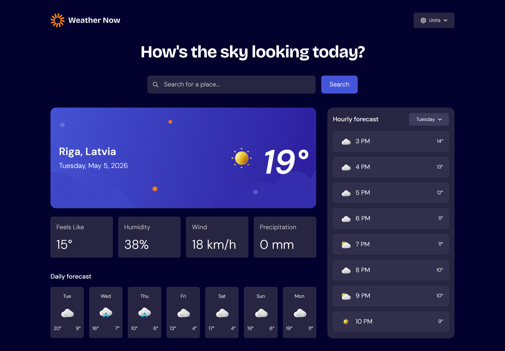

# Weather app

This is a weather application built with React (Vite) that allows users to search for locations and view current weather conditions along with daily and hourly forecasts.

## Live Site

[View Live Site](https://tranquil-pixie-1a6cff.netlify.app/)

## Features

- Search for a city with autocomplete suggestions
- Detect user location using geolocation
- Current weather data display
- 7day forecast
- 24hour forecast
- Unit switching (metric / imperial)
- Error handling and loading states

## Technologies

- React (Vite)
- JavaScript (ES6+)
- Tailwind CSS
- Open-Meteo API
- OpenStreetMap Nominatim API
- Day.js

## Getting Started

1. Clone the repository: git clone URL
2. Navigate to the project folder: cd weather-app
3. Install dependencies: npm install
4. Run the development server: npm run dev
5. Open http://localhost:5173 in your browser

## Author

Created as a learning project to improve React and APIs skills.
